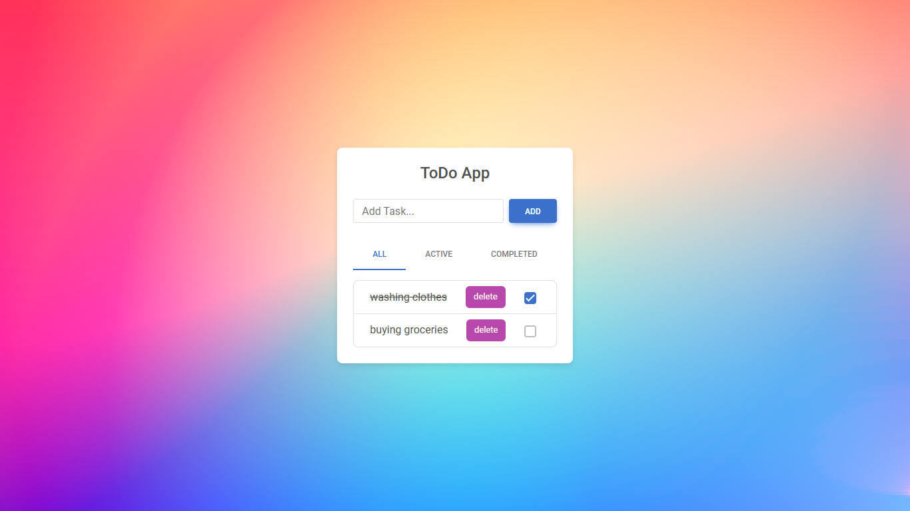

# Vanilla JavaScript Task Manager

A simple task manager built with HTML, CSS, JavaScript, jQuery, Bootstrap/MDB, and browser LocalStorage.

This was developed as a university software project and frontend practice project. The main goal was to practice DOM manipulation, event handling, filtering tasks, and saving data in the browser.

## Live Demo

https://asal-chan.github.io/vanilla-js-task-manager/

## Preview

The app supports adding tasks, marking them as completed, deleting them, and filtering tasks by status.

## Features

- Add new tasks
- Mark tasks as completed or active
- Delete tasks
- Filter tasks by status:
  - All
  - Active
  - Completed
- Save tasks in LocalStorage
- Basic responsive layout using Bootstrap/MDB

## Built With

- HTML
- CSS
- JavaScript
- jQuery
- Bootstrap / MDB
- LocalStorage

## Project Structure

- `index.html`
- `css/style.css`
- `js/localStorageAdapter.js`
- `js/todo-list1.js`
- `screenshots/task-manager-preview.png`

## Notes

Most of the JavaScript logic was written as part of my own frontend practice. The UI is based on Bootstrap/MDB components and styling.

The project is small, but it helped me understand how client-side state, DOM updates, event handling, and browser storage work together in a frontend application.

## Possible Improvements

- Add edit functionality
- Add task priorities
- Add due dates
- Add search
- Improve mobile responsiveness
- Refactor the project with React
